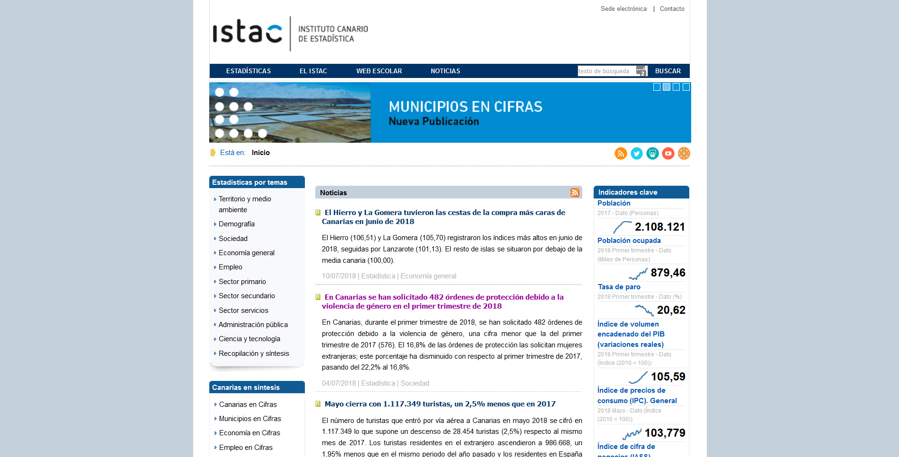
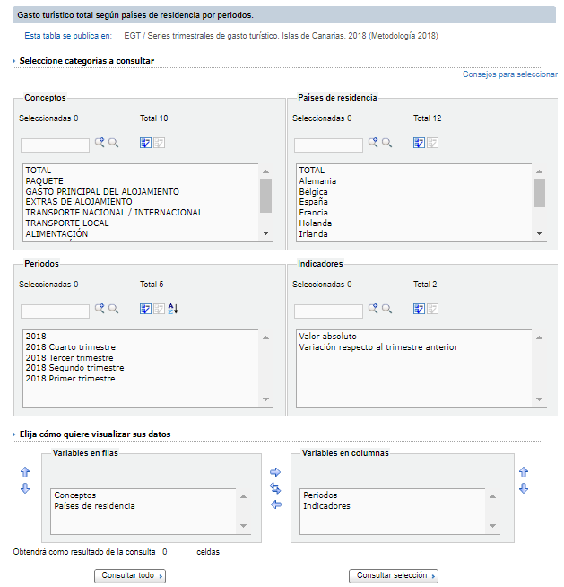
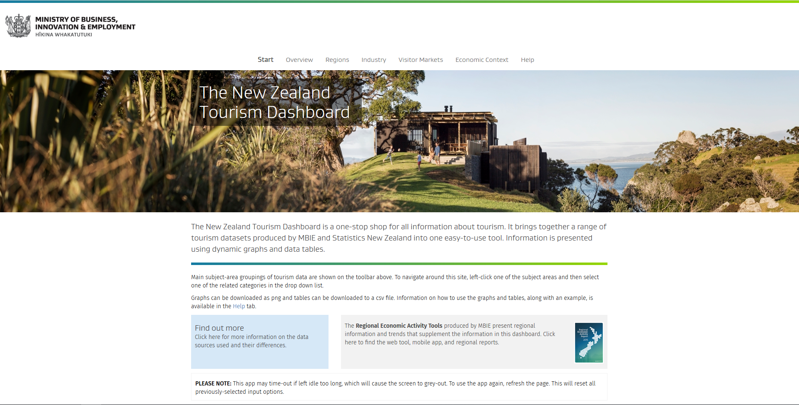
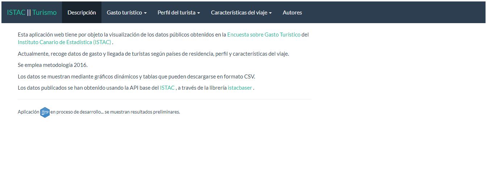
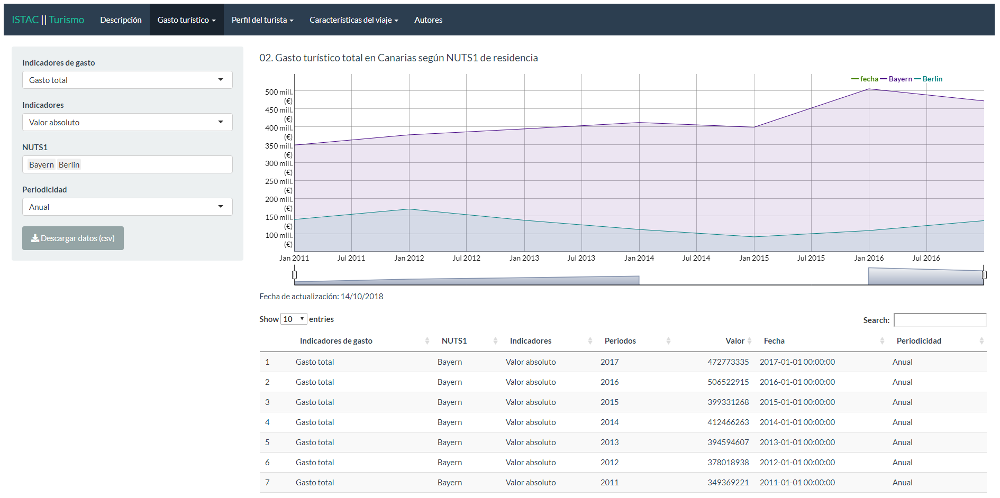
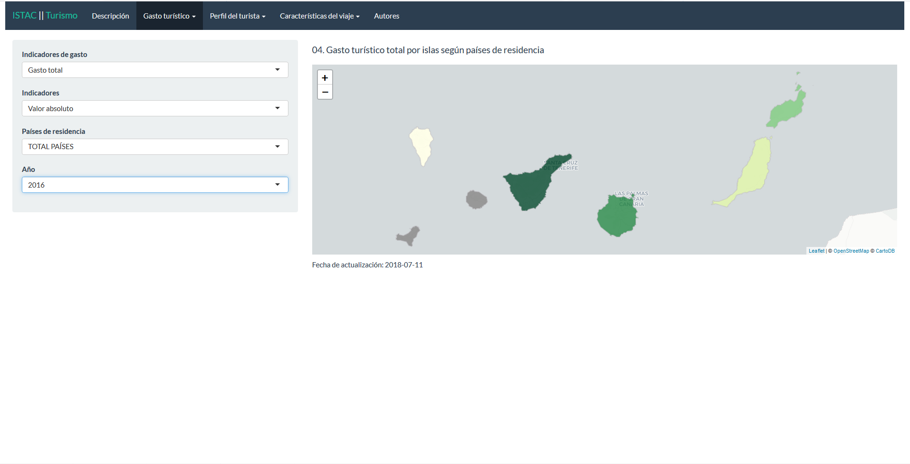
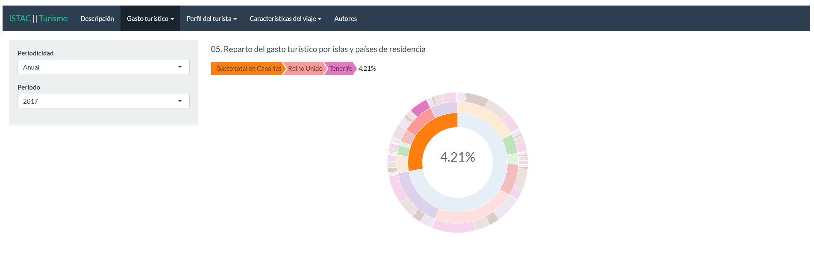
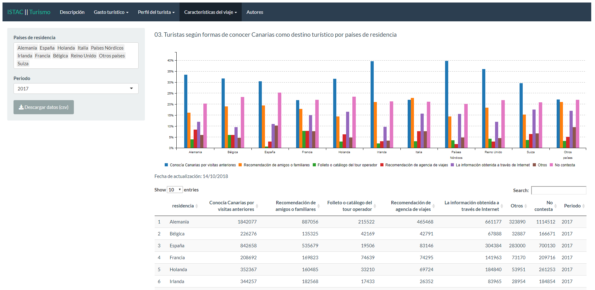

```{r setup, include=FALSE}
options(htmltools.dir.version = FALSE)
```


```{r xaringan-themer, include = FALSE}
# https://github.com/gadenbuie/xaringanthemer/blob/master/vignettes/css-help.Rmd
library(xaringanthemer)
mono_accent(
  base_color = "#1D3D70",
  header_font_google = google_font("Josefin Sans"),
  text_font_google   = google_font("Montserrat", "300", "300i"),
  code_font_google   = google_font("Droid Mono")
)
```


class: inverse, center, middle

# ¿POR QUÉ REALIZAR ESTE PROYECTO?

---

# Introducción

En la actualidad el incremento de fuentes de datos públicas proporciona amplias oportunidades a la investigación.

Este trabajo se enfoca en la reutilización de los datos que proporciona el Instituto Canario de Estadística ([ISTAC](http://www.gobiernodecanarias.org/istac/)).

Por un lado busca facilitar la consulta y descarga de los datos disponibles en [ISTAC](http://www.gobiernodecanarias.org/istac/). Asimismo se emplea este desarrollo para la elaboración de una aplicación web de utilidad al público en general y a los profesionales del sector turístico en particular, que permite un estudio interactivo y amigable de la evolución del sector.

---

background-image: url("images/istac.png")
background-position: 85% 1%
background-size: 200px auto

# Usando la interfaz de ISTAC

> El Instituto Canario de Estadística (ISTAC), es el órgano central del sistema estadístico autonómico y centro oficial de investigación del Gobierno de Canarias, responsable entre otras tareas de proveer información y coordinar la actividad estadística pública en Canarias.

[](http://www.gobiernodecanarias.org/istac/)

---

# Usando la interfaz de ISTAC

.pull-left[
.texto2[
Los analistas del sector turístico acceden mediante la web a los datos del [ISTAC](http://www.gobiernodecanarias.org/istac/) para consultar la evolución del sector.

Es habitual que elaboren sus propias bases de datos a partir de estas, de modo que acceden de manera recurrente. 

Esto requiere navegar por la interfaz y realizar múltiples clicks y selecciones, puede resultar tedioso dependiendo de la frecuencia en la que se haga.

Ejemplo de búsqueda:
* Sector servicios
* Encuesta sobre Gasto Turístico
* Series según metodoglogía 2018
* EGT / Series trimestrales de gasto turístico. Islas de Canarias. 2018 (Metodología 2018)
* Gasto turístico total según países de residencia.
* Configurar tabla
]
]

.pull-right[

]

> No es un proceso escalable.

---

# Motivación en el uso de Shiny

La inspiración de este proyecto, especialmente en lo que a visualización de datos se refiere, proviene de Nueva Zelanda.

En concreto, [The New Zealand Tourism Dashboard](http://tourismdashboard.mbie.govt.nz/).

Un proyecto espectacular.



---

# Tools

Dando respuesta a los dos apartados indicados:

* [istacbaser](https://github.com/rOpenSpain/istacbaser): R package para acceder de manera programática a los datos disponibles mediante ISTACbase.


* [Canary Islands Tourism Dashboard](https://jmcartiles.shinyapps.io/canary_islands_tourism_dashboard/): Aplicación web desarrollada empleando [Shiny](https://shiny.rstudio.com/) que explota la información generada en la [Encuesta sobre Gasto Turístico](http://www.gobiernodecanarias.org/istac/temas_estadisticos/sectorservicios/hosteleriayturismo/demanda/C00028A.html).


---


class: inverse, center, middle

# ACCESO A LOS DATOS
# istacbaser

---
background-image: url("images/ropenspain.png")
background-position: 85% 7%
background-size: 200px auto


# ISTACBASER

[istacbaser](https://github.com/rOpenSpain/istacbaser) es un R package para acceder de manera programática a todas las tablas de datos disponibles mediante ISTACbase. Actualmente es una contribución a la comunidad de software libre y datos abiertos [rOpenSpain](https://ropenspain.es/).

# ¿Cómo usar istacbaser?<br>Sencillo...

Aquí se indica una [guía de uso](http://jmcartiles.netlify.com/post/istacbaser-a-quick-example-i/).

---

# Instalar istacbaser

Lo primero es descargar el R package desde Github y cargar los packages necesarios para este ejemplo, **dplyr** y **ggplot2**.

```{r comment='#', warning=FALSE, echo = TRUE, message=FALSE}
# install and load istacbaser
# install.packages("devtools")
# library(devtools)
# install_github("rOpenSpain/istacbaser")
library(istacbaser)

# Load essentials package for this example
# install.packages("dplyr")
# install.packages("ggplot2")
library(dplyr)
library(ggplot2)
```


---

# Consultar datasets disponibles (I)

Un objeto clave en este package es `istacbaser::cache`. En este dataframe se recoge la información referida a cada una de las tablas disponibles. Puede verse mediante:

```{r comment="#"}
glimpse(cache)
```


---

# Consultar datasets disponibles (II)

La función `istacbaser::istacbase_search` permite buscar tablas en base a un patrón determinado. La búsqueda se realiza por defecto en la variable `titulo`. Es posible el uso de expresiones regulares.

```{r}
busqueda.paro <- istacbase_search("paro")
busqueda.paro.empleo <- istacbase_search("paro|empleo")
```

* Buscar en distintas variables de **cache** con el parámetro `fields`

En este ejemplo se muestra el gasto total en turismo en las Islas Canarias por año y país de origen. Al tratarse de gasto en turismo, se realiza una consulta para el string *"egt"* (Encuesta de Gasto Turístico). El campo debe ser *"datos publicadosII"*.

```{r}
busqueda.egt <- istacbase_search("egt",
                                 fields = "datos publicadosII" #<<
                                 )
```


---

Al observar el dataframe generado en el paso anterior se elige el *"ID"* que resulte de interés para la consulta.

.texto2[
```{r}
head(busqueda.egt$titulo, n=20)
```
]

El primer elemento contiene el dataset que se busca, se indica el *"ID"*.

.texto2[
```{r}
busqueda.egt$ID[1]
```
]

---

# Descargar datos de [ISTAC](http://www.gobiernodecanarias.org/istac/)


En una línea el dataset completo está listo para usarse:

```{r, warning=FALSE}
df <- istacbase(busqueda.egt$ID[1], POSIXct = TRUE, freq = "anual")
```


Hay diversos parámetros disponibles para afinar la consulta:
* islas: nombre de las islas solicitadas. Por defecto *"all"*
* labels: determina si el dataframe devuelve los codigos o las etiquetas
* POSIXct: incluir columnas adicionales fecha y periodicidad
* startdate: fecha de inicio
* enddate: fecha de fin
* freq: indica la periodicidad
* mrv: número de observaciones solicitadas, inicia en las más actuales


---

# Representar los resultados usando ggplot

Se filtra el dataframe:

.texto2[
```{r}
df.anual <- filter(df,
                     Indicadores == "Valor absoluto" &
                     `Indicadores de gasto` == "GASTO TOTAL" &
                     `Países de residencia` != "TOTAL PAÍSES")
```
]

Finalmente, usando *ggplot* la evolución del gasto total anual es:

.pull-left[
.texto2[
```{r, eval=FALSE, echo=TRUE}
library(ggplot2)

ggplot(df.anual,
       aes(x = Periodos,
           y = valor,
           fill = `Países de residencia`))  +
  geom_col(position = "dodge") +
  xlab("") +
  ylab("") +
  theme(
    panel.background = element_blank(),
    axis.ticks = element_blank()
  )
```
]
]

.pull-right[
```{r, echo=FALSE}
library(ggplot2)

ggplot(df.anual, aes(x = Periodos, y = valor,
                     fill = `Países de residencia`)) +
  geom_col(position = "dodge") +
  xlab("") +
  ylab("") +
  theme(
    panel.background = element_blank(),
    axis.ticks = element_blank()
  )
```
]

---

class: inverse, middle, center

# VISUALIZANDO LOS RESULTADOS
# The Canary Islands Tourism Dashboard

---

# La elección de los datos

Dada la relevancia del turismo en la economía canaria, así como el acceso a la cantidad ingente de información que hay disponible a través del [ISTAC](http://www.gobiernodecanarias.org/istac/) resulta necesario fomentar el conocimiento y la difusión del mismo.

Con este fin se ha elaborado esta aplicación que pretende ser un ejemplo de las posibilidades que ofrece la explotación de los datos en R.

Esta aplicación emplea el servicio web ISTACbase a través de istacbaser. Se usa la información obtenida de la Encuesta de Gasto Turístico de Canarias.

---

# Estructura de la aplicación web con Shiny

Se estructura en tres secciones de estudio:

* Gasto turístico
* Perfil del turista
* Características del viaje



---

# Estructura de las secciones

Las secciones presentan a la izquierda un panel de filtrado, que facilita al usuario la selección interactiva de los resultados. Al mismo tiempo se actualiza el gráfico y los datos mostrados en la tabla inferior.




---

# Visualizaciones disponibles

Se resumen los distintos tipos visualizaciones de la aplicación ([enlace](https://jmcartiles.shinyapps.io/canary_islands_tourism_dashboard/)) actualmente, que son:

.pull-left[]

.pull-right[]


.pull-left[]

.pull-right[]

---

# Conclusiones

> La librería reduce de forma importante el tiempo de descargar los datos desde la web y luego importarlo a R.

> La aplicación Shiny permite integrar en varios cuadros de mando diferentes visualizaciones de los datos.

> La combinación de, por un lado datos públicos, como en este caso aporta el [ISTAC](http://www.gobiernodecanarias.org/istac/) y, por otro lado, diferentes herramientas y lenguajes de programación como en este caso [Github](https://github.com/) y [R](https://www.r-project.org/), dan la posibilidad de concretar estas ideas en un dashboard de turismo de uso libre.

---

class: inverse, middle, center

# ¡GRACIAS!


